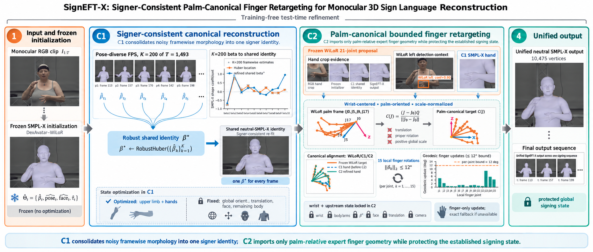

# SignAlign: Signer-Consistent Reconstruction and Palm-Canonical Finger Retargeting for Monocular 3D Sign Language

[](LICENSE)
[](pyproject.toml)

Official implementation of **SignAlign: Signer-Consistent Reconstruction and
Palm-Canonical Finger Retargeting for Monocular 3D Sign Language**.

**Author:** Dinh Hieu Vu

**Affiliation:** Posts and Telecommunications Institute of Technology (PTIT)

SignAlign starts from per-frame SMPL-X estimates, recovers one robust identity
for the signer, re-fits the upper-limb chain under that shared identity, and
then uses palm-canonical WiLoR evidence to refine only finger articulation. No
reference mesh, evaluator, or ground-truth geometry is accepted by the
inference API.



## What is released

- The complete SignAlign C1/C2 implementation in `src/signalign`.
- A reproducible DexAvatar–WiLoR initializer frontend covering Sapiens,
  SMPLer-X, WiLoR, DexAvatar fitting, SignBPoser, and SignHPoser.
- Immutable manifest and checksum contracts for RGB frames, initializers,
  WiLoR observations, intermediate states, and final meshes.
- Unit tests, a release audit, pinned third-party revisions, and isolated
  post-hoc evaluation commands.

The upstream projects are not copied into this repository. Their code and
model assets have separate terms, so the setup helper checks out exact source
revisions under the ignored `external/` directory. See
[THIRD_PARTY.md](THIRD_PARTY.md) before downloading models.

## Method

1. **C0 — frozen monocular initialization.** The provided frontend runs
   Sapiens keypoints, SMPLer-X initialization, WiLoR hand estimation, and the
   released DexAvatar fitter with SignBPoser/SignHPoser. A deterministic view
   selects a complete primary frame or one whole fallback frame; it never
   splices parameters from different initializers.
2. **C1 — signer-consistent canonicalization.** A Huber location estimate over
   pose-diverse calibration frames yields one shared SMPL-X shape. Only the
   shoulders, elbows, wrists, and hands may absorb the identity change while
   global placement is retained.
3. **C2 — bounded palm-canonical refinement.** WiLoR joints are root-centered,
   aligned to a local palm frame, and scale-normalized. Optimization changes
   only the 15 local finger rotations per detected hand, with each residual
   bounded to 12 degrees. Body, wrists, identity, face, translation, and camera
   stay fixed. A missing hand observation leaves that side bit-identical to C1.

The implementation intentionally contains no Transformer or temporal network.
See [docs/METHOD.md](docs/METHOD.md) for invariants and tensor contracts.

## Repository structure

```text
SignAlign/
├── assets/                  # method overview used by this README
├── configs/                 # portable inference template
├── docs/                    # method, installation, and data contracts
├── scripts/                 # pinned setup, frontend, WiLoR, and audit tools
├── src/signalign/
│   ├── canonical/           # robust identity and signer-consistent C1 fit
│   ├── frontend/            # immutable initializer/WiLoR adapters
│   ├── hand/                # bounded palm-canonical C2 refinement
│   ├── io/                  # strict array and mesh serialization
│   ├── model/               # SO(3) kinematics
│   ├── pipeline.py          # target-free inference orchestration
│   └── evaluation.py        # isolated post-hoc evaluator adapter
└── tests/                   # geometry, boundary, pipeline, and release tests
```

## Installation

Requirements: Linux, Python 3.10+, Git, Conda, and an NVIDIA CUDA GPU for the
full model pipeline. CPU-only linting and unit tests are supported. GPU memory,
storage, and runtime depend on sequence resolution/length and the selected
upstream checkpoints, so no unsupported minimum is claimed here.

Install the SignAlign package first:

```bash
git clone git@github.com:Hieuvu4438/SignAlign.git
cd SignAlign
conda env create -f environment.yml
conda activate sign-align
```

For the full frontend, materialize the pinned upstream source trees:

```bash
python scripts/setup_external.py
```

DexAvatar, Sapiens, SMPLer-X, and WiLoR require separate environments and
licensed model files. Follow [docs/INSTALL.md](docs/INSTALL.md) for their exact
locations and verification commands.

## Quick start

Input RGB frames are grouped by sign:

```text
/data/rgb/
├── sign_001/000001.png
├── sign_001/000002.png
└── sign_002/000001.png
```

Run the complete DexAvatar–WiLoR initializer. The command is fail-fast and uses
argument lists rather than interpolated shell commands; `--dry-run` prints the
exact execution plan without launching models.

```bash
python scripts/run_dexavatar_wilor.py \
  --input-root /data/rgb \
  --output-root /data/frontend \
  --external-root ./external \
  --resume
```

Freeze the intended target-free RGB split:

```bash
signalign prepare-manifests \
  --rgb-root /data/rgb \
  --signs /data/protocol/signs.txt \
  --segments /data/protocol/segments.json \
  --output /data/signalign-output/manifests \
  --expected-signs 57 \
  --expected-frames 1493
```

Create a full-coverage, immutable initializer view. If the primary run covers
every frame, it can also be supplied as the fallback; otherwise use a complete
target-free baseline reconstruction.

```bash
signalign build-initializer \
  --manifest /data/signalign-output/manifests \
  --primary /data/frontend \
  --fallback /data/baseline \
  --output /data/initializer-view
```

Reuse the per-sign WiLoR sidecars produced by the frontend and validate the C2
cache:

```bash
signalign merge-wilor \
  --sidecars /data/frontend/*/wilor/wilor.pkl \
  --output /data/wilor/raw.pkl

signalign import-wilor \
  --manifests /data/signalign-output/manifests \
  --sidecar /data/wilor/raw.pkl \
  --output /data/wilor/cache

signalign validate-wilor \
  --manifests /data/signalign-output/manifests \
  --cache /data/wilor/cache \
  --output /data/wilor/validation.json
```

Copy `configs/inference.example.yaml` to the ignored
`configs/inference.local.yaml`, point it at those artifacts, then run SignAlign:

```bash
# Copy and edit configs/inference.example.yaml first.
signalign infer --config configs/inference.local.yaml
```

The WiLoR cache must exist before `infer`. A standalone WiLoR extraction path
is documented in [docs/DATA_AND_MODELS.md](docs/DATA_AND_MODELS.md).
Final states, meshes, and per-frame decisions are written beneath
`paths.output_root/predictions`.

## Verified reference run

The target-free release audit passes on the complete 57-sign / 1,493-frame
split: 57 canonical sequences, 1,493 states, 1,493 meshes, and 1,493 decisions.
It records 2,596 accepted hand refinements and 27 frames with an explicit
hand-expert-unavailable fallback.

| Metric | mm |
|---|---:|
| Official TR upper body | 25.7755 |
| Official TR upper body minus face | 29.0791 |
| Official TR left hand | 12.2806 |
| Official TR right hand | 11.4150 |
| PA-MPVPE upper body | 26.4008 |
| PA-MPVPE upper body minus face | 30.1391 |
| PA-MPVPE left hand | 8.1493 |
| PA-MPVPE right hand | 8.7999 |

Metrics are computed only after predictions have been frozen; evaluation data
is not reachable from the inference API. Counts, artifact hashes, evaluator
hash, and displayed metrics are recorded in
[`docs/reference_run.json`](docs/reference_run.json); raw predictions and
licensed reference data are intentionally not distributed.

## Audit and evaluation

Audit a completed run before evaluation:

```bash
python scripts/audit_release.py \
  --config configs/inference.local.yaml \
  --output /data/signalign-output/release_audit.json
```

Evaluation is deliberately downstream of frozen prediction export:

```bash
signalign export \
  --manifest /data/signalign-output/hand_manifest.jsonl \
  --predictions /data/signalign-output/predictions \
  --output /data/signalign-output/evaluation-layout

signalign evaluate \
  --evaluator /path/to/official_evaluator.py \
  --evaluator-sha256 EXPECTED_SHA256 \
  --predictions /data/signalign-output/evaluation-layout \
  --reference /path/to/reference_meshes \
  --signs /data/protocol/signs.txt \
  --segments /data/protocol/segments.json \
  --output /data/signalign-output/evaluation
```

## Development

```bash
python -m pip install -e ".[dev]"
ruff check .
pytest -q
python -m build
```

The tests exercise target-free API boundaries, whole-frame initializer
selection, palm-frame invariance, SO(3) residual bounds, batch-preserving
parallel partitioning, external revision locks, and the public release layout.

## Limitations

- The public frontend expects pre-segmented RGB frame folders and protocol
  metadata; video decoding is a separate deterministic preprocessing step.
- Monocular depth ambiguity and missed/incorrect WiLoR detections remain
  failure modes. Missing detections trigger the documented C1 fallback rather
  than hallucinated hand updates.
- SignAlign enforces signer identity consistency but does not use a temporal
  network, so it does not explicitly model motion dynamics.
- SMPL-X/MANO and several upstream checkpoints require separate license
  acceptance. WiLoR restrictions make the complete dependency stack
  unsuitable for unapproved commercial use.

## Citation

The paper citation will be added when it is publicly available. Until then,
please cite the software metadata in [CITATION.cff](CITATION.cff):

```bibtex
@software{vu2026signalign,
  author = {Dinh Hieu Vu},
  title = {SignAlign: Signer-Consistent Reconstruction and Palm-Canonical Finger Retargeting for Monocular 3D Sign Language},
  year = {2026},
  url = {https://github.com/Hieuvu4438/SignAlign}
}
```

## License

The original SignAlign code is released under the [MIT License](LICENSE).
Third-party code, datasets, body models, and checkpoints are not relicensed;
their terms remain in force. In particular, WiLoR assets are restricted to
non-commercial research use. See [THIRD_PARTY.md](THIRD_PARTY.md).
